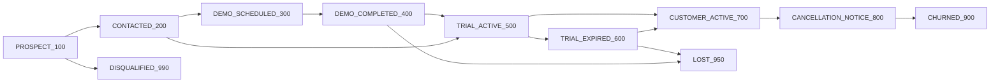

# SaleVali Marketing CRM

Internal CRM for the marketing team behind [SaleVali](https://salevali.de) — the cloud
multichannel ERP (Warenwirtschaft) that BCS-IT GmbH sells to online merchants. The purpose of this
app is to **grow the number of SaleVali customers**.

Built with **Next.js 15**, **React 19**, **TypeScript**, **Prisma 5**, **MySQL**, **NextAuth 4**,
**Tailwind CSS**, **Nodemailer**, and **Docker**.

## Who tracks whom

This distinction drives the whole data model:

- **The records we track are SaleVali's customers** — online merchants selling on Amazon, eBay,
  OTTO, Shopify and the like, who use or should use SaleVali. `Customer` is the central entity.
- **The marketing team are the operators, not the records.** A marketer is a `User`: they log in,
  own customers (`Customer.assignedTo`), log interactions, and complete tasks. They are never the
  thing being tracked.

## Domain model

| Model | Purpose |
| --- | --- |
| `Customer` | A merchant company: the central record. Company data, funnel stage, billing model, transaction volume, trial and subscription dates. |
| `Contact` | A person at a customer company (owner, ops lead, accountant). Belongs to a `Customer`. |
| `CustomerIntegration` | Which marketplaces, shops and carriers the customer runs — segmentation signal and the concrete value SaleVali delivers. One row per channel. |
| `Interaction` | Every logged touch: email, call, WhatsApp, meeting, demo, onboarding, note. |
| `Task` | Follow-up work owned by a marketer for a specific customer. |
| `StageChange` | Audit trail of lifecycle transitions, so funnel conversion and time-in-stage are measured, not guessed. |
| `Campaign` | Acquisition channel (affiliate push, ad set, consultant partnership, webinar). Attribution only — not the main entity. |
| `User` | A member of the marketing team. |
| `InvitationToken` | One-time, signed invite for onboarding new team members. |

## Customer lifecycle

Modeled on the real SaleVali funnel: consultation or demo, a 30-day free trial with no automatic
renewal, then a paying subscription that can be cancelled by email with 30 days' notice.



Stage moves derive their own dates, so the timeline stays consistent no matter which screen made
the change (`src/lib/lifecycle.ts`):

- entering `TRIAL_ACTIVE_500` fills `trialStartedAt` and a `trialEndsAt` 30 days later, without
  overwriting dates that already exist;
- `CUSTOMER_ACTIVE_700` stamps `convertedAt`;
- `CANCELLATION_NOTICE_800` stamps `cancellationNoticeAt` (the contract then ends 30 days later);
- `CHURNED_900` stamps `churnedAt`; churned / lost / disqualified also set `closedAt`;
- reopening a closed customer clears `closedAt` so reports stay truthful.

Every transition is written to `StageChange` with an optional reason.

## Billing model

SaleVali's public pricing is encoded in `src/lib/constants.ts` and used to estimate revenue per
account when no explicit MRR is recorded:

- **`INVOICE_ONLY_FIXED`** — no API connection, invoicing only: a flat **€9.90/month**.
- **`API_TRANSACTION_TIERED`** — API-connected, billed per transaction per month:
  first 100 at **€0.20**, 101–1000 at **€0.05**, from 1001 at **€0.033**.

Billing runs via SEPA direct debit, so each customer carries a `sepaMandateStatus`.

## Features

- **Role-based authentication** with NextAuth credentials sign-in (`ADMIN` / `MANAGER` / `MARKETER`)
- **Customer funnel tracking** from prospect through trial, subscription, and churn
- **Trial watchlist** — trials ending within 7 days surface on the dashboard, since SaleVali trials
  never auto-renew and need an explicit decision
- **Revenue view** — recorded MRR, or an estimate derived from the pricing tiers
- **Channel tracking** per customer across marketplaces, shops, and carriers
- **Interactions and tasks** logged directly on the customer, with completion toggling
- **Stage history** for funnel and time-in-stage reporting
- **Campaign attribution** for acquisition channels
- **Admin invitations** powered by Nodemailer and one-time registration tokens
- **Dockerized MySQL** for local development

## App structure

- `/login`, `/register` (invite-token gated)
- `/dashboard` — funnel counts, paying customers, active trials, recurring revenue, expiring trials
- `/dashboard/customers` — list with search and stage / billing-model / channel filters
- `/dashboard/customers/new` — create a customer including the channels they sell on
- `/dashboard/customers/[id]` — full record: stage moves, timeline, contacts, channels,
  interactions, tasks, stage history
- `/dashboard/contacts`, `/dashboard/campaigns`, `/dashboard/users`

## API routes

- `POST /api/auth/[...nextauth]` — authentication via NextAuth
- `GET|POST /api/customers` — list (filters: `q`, `stage`, `pricingModel`, `channel`) and create
- `GET|PATCH|DELETE /api/customers/:id`
- `POST /api/customers/:id/stage` — move lifecycle stage and record the transition
- `GET|POST /api/customers/:id/interactions`
- `GET|POST /api/customers/:id/tasks`
- `GET|PUT /api/customers/:id/integrations` — `PUT` upserts one channel
- `PATCH|DELETE /api/tasks/:id`
- `GET|POST /api/contacts` — optional `customerId` filter
- `GET|POST /api/campaigns`
- `GET /api/users`, `POST /api/users/invite`, `POST /api/register`
- `GET /api/health` — liveness (`?db=1` for DB connectivity); detailed fields gated on `HEALTH_TOKEN`
- `GET /api/health/smtp` — SMTP connectivity check; requires an admin session or `HEALTH_TOKEN`

## Roles

- **ADMIN** — full access, user management, invitations
- **MANAGER** — operational oversight, may delete customers
- **MARKETER** — day-to-day CRM execution and follow-ups

## Local setup

1. Copy environment variables:

   ```bash
   cp .env.example .env
   ```

2. Start MySQL:

   ```bash
   npm run db:dev:up
   ```

3. Install dependencies:

   ```bash
   npm install
   ```

4. Push the Prisma schema:

   ```bash
   npx prisma db push
   ```

5. Seed the first admin user:

   ```bash
   npm run seed
   ```

6. Start the app:

   ```bash
   npm run dev
   ```

Open [http://localhost:3000](http://localhost:3000).

## Testing

```bash
npm run test:e2e         # full Playwright suite (starts the app itself)
npm run test:e2e:smoke   # the @smoke subset — what the PR gate runs
```

See [`docs/testing.md`](docs/testing.md) for what is covered and how to write a
spec that is not flaky.

## Deployment

The image is built on a GitHub-hosted runner and pushed to ghcr.io; the server's
self-hosted runner pulls it, backs up the database, runs the destructive-schema
guard, applies the schema, swaps the container and health-checks it. Nothing
compiles on the server. See [`infra/README.md`](infra/README.md).

## Where the work goes next

[`docs/BACKLOG.md`](docs/BACKLOG.md) — the deferred work, with the reasoning and
a first slice for each item.

## Required environment variables

```env
DATABASE_URL=
NEXTAUTH_URL=
NEXTAUTH_SECRET=
HEALTH_TOKEN=
SMTP_HOST=
SMTP_PORT=
SMTP_USER=
SMTP_PASS=
SMTP_FROM=
SEED_ADMIN_EMAIL=
SEED_ADMIN_PASSWORD=
SEED_ADMIN_NAME=
```

## Docker

Use the included development database compose file:

```bash
docker compose -f docker-compose.dev.yml up -d
```

The production `Dockerfile` builds a standalone Next.js image suitable for container deployment.

## Seeding

The seed script creates or updates the first admin using `SEED_ADMIN_EMAIL`,
`SEED_ADMIN_PASSWORD`, and `SEED_ADMIN_NAME`.

## Notes

- Dashboard pages fetch directly from Prisma using App Router server components; mutations go
  through server actions, with matching REST routes for integrations and scripting.
- Invitations are one-time tokens stored in MySQL and delivered with Nodemailer.
- Contacts carry a unique email, so importing the same person twice returns a `409` instead of
  creating a duplicate.
