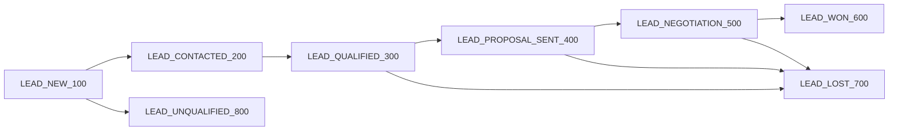

# Marketing CRM

Marketing CRM is a modern full-stack customer relationship and campaign operations app built with **Next.js 15**, **React 19**, **TypeScript**, **Prisma 5**, **MySQL**, **NextAuth 4**, **Tailwind CSS**, **Nodemailer**, and **Docker**.

It is adapted from the Internship CRM concept, but tailored for marketing and sales workflows: leads move through a defined pipeline, campaigns can be tracked against sourced demand, interactions are logged per lead, and teams collaborate with role-based access.

## Features

- **Role-based authentication** with NextAuth credentials sign-in
- **Lead pipeline tracking** from net-new lead through won/lost outcomes
- **Contacts management** for people and companies behind each lead
- **Campaign tracking** with status, budget, and sourced lead visibility
- **Tasks and interactions** modeled in Prisma for follow-up coordination
- **Admin invitations** powered by Nodemailer and one-time registration tokens
- **Dockerized MySQL** for local development

## Tech stack

- Next.js 15 App Router
- React 19 + TypeScript
- Prisma 5 + MySQL
- NextAuth 4
- Tailwind CSS
- Nodemailer
- Docker / Docker Compose

## Lead pipeline



## Roles

- **ADMIN** — full access, user management, invitations
- **MANAGER** — operational oversight for leads, contacts, campaigns
- **MARKETER** — day-to-day CRM execution and follow-ups

## Domain models

- **Users**
- **Invitation tokens**
- **Contacts**
- **Leads**
- **Campaigns**
- **Interactions**
- **Tasks**

## Local setup

1. Copy environment variables:

   ```bash
   cp .env.example .env
   ```

2. Start MySQL:

   ```bash
   npm run db:dev:up
   ```

3. Install dependencies:

   ```bash
   npm install
   ```

4. Push the Prisma schema:

   ```bash
   npx prisma db push
   ```

5. Seed the first admin user:

   ```bash
   npm run seed
   ```

6. Start the app:

   ```bash
   npm run dev
   ```

Open [http://localhost:3000](http://localhost:3000).

## Required environment variables

```env
DATABASE_URL=
NEXTAUTH_URL=
NEXTAUTH_SECRET=
SMTP_HOST=
SMTP_PORT=
SMTP_USER=
SMTP_PASS=
SMTP_FROM=
SEED_ADMIN_EMAIL=
SEED_ADMIN_PASSWORD=
SEED_ADMIN_NAME=
```

## API routes

- `POST /api/auth/[...nextauth]` — authentication via NextAuth
- `GET|POST /api/leads`
- `GET|PATCH|DELETE /api/leads/:id`
- `GET|POST /api/contacts`
- `GET|POST /api/campaigns`
- `GET /api/users`
- `POST /api/users/invite`
- `POST /api/register`

## Docker

Use the included development database compose file:

```bash
docker compose -f docker-compose.dev.yml up -d
```

The production `Dockerfile` builds a standalone Next.js image suitable for container deployment.

## Seeding

The seed script creates or updates the first admin using:

- `SEED_ADMIN_EMAIL`
- `SEED_ADMIN_PASSWORD`
- `SEED_ADMIN_NAME`

## Notes

- Dashboard pages fetch directly from Prisma using App Router server components.
- Invitations are one-time tokens stored in MySQL and delivered with Nodemailer.
- Lead detail pages surface related tasks and interactions to centralize follow-up work.
